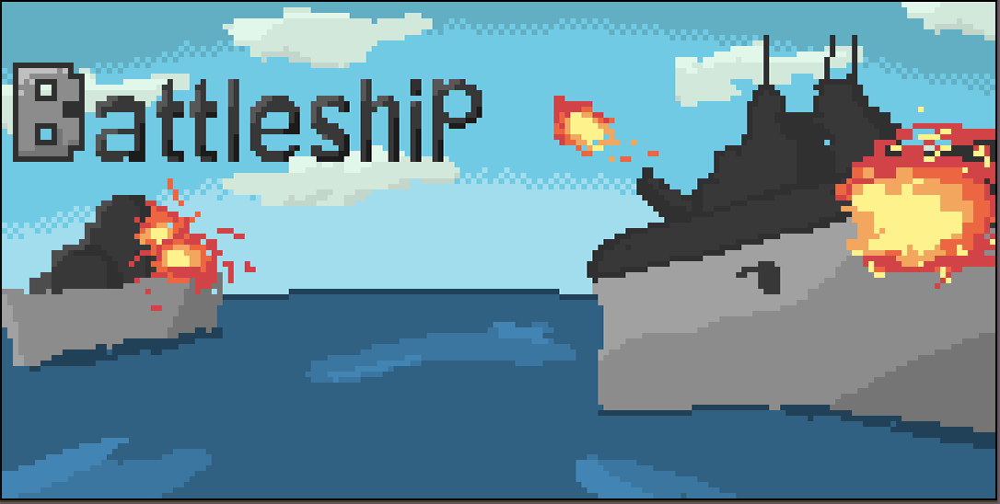
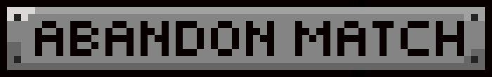

# **Assembly-Battleship**

## **Repository to archive Battleship project in Assembly and C++**

### **Developed by:**

+ [Archibald Carrion](https://github.com/archibald-carrion) (C++ SFML developer)
+ [Fabián Vega](https://github.com/Fabian-Vega) (C++ developer / sprite designer)
+ [Alberto González](https://github.com/albgondiga) (Assembly developer / C++ developer)
+ [Luis Solano](https://github.com/GoninDS) (Assembly developer / C++ developer)

### **Project description:**

This repository is used to archive the development and code of an implementation of the board game Battleship. For the creation of this project C++ was used to handle the states of the game and the representation of the graphic design. Assembly was used to handle the game functions directly.

*Developed during August-November 2022*

### **Battleship rules:**

1. Players must place their ships in (horizontal or vertical) valid positions according to the ship size.

2. The game is turn-based, if a player hits a ship their turn will continue until they miss. 

3. To win a match, a player must sink all of the enemy ships. Each player, in their respective turns, can also abandon the game forfeiting the match.

4. To damage a ship each player must guess the position in a 7x7 board. If the player guesses correctly, the attack on the ship will be registered with a **red square**. To completely sink a ship all parts of the ship must be hit.  

5. It is forbidden to attack positions out of the board or previously attacked positions.

6. Players can't see the position of their opponent's ships unless they are hit or sunken.

### **How to play:**

The game consists of two different phases. During the first phase players will place their ships, this can only be done **at the beginning of the match**.

To place a ship correctly, follow the following steps:

1. Press the number of the desired **column**

2. Press the **enter** key to confirm the column. In case of wanting to place the ship on a different position press **backspace**. 

3. Repeat the same process for the **row**

4. Press the green arrow button **on screen** to choose a direction

5. Press the **PLACE SHIP** button

To attempt an attack follow the following steps:

1. Press the number of the desired **column**

2. Press the **enter** key to confirm the column. In case of wanting to place the ship on a different position press **backspace**. 

3. Repeat the same process for the **row**

4. Press the **ATTACK** button

### **Compilation manual:**

To compile the program, you must be on a Linux distribution (preferably Ubuntu). Because the graphic interface is done through **SFML** it is required that it is installed. In case of not having **SFML** installed, you can execute the following command in the terminal:

    sudo apt-get install libsfml-dev

In case of having doubts about the **SFML** installation you can consult

    https://www.sfml-dev.org/tutorials/2.5/start-linux.php

To compile execute the following command inside the dev folder

    make

Then to execute run

    ./game.out

